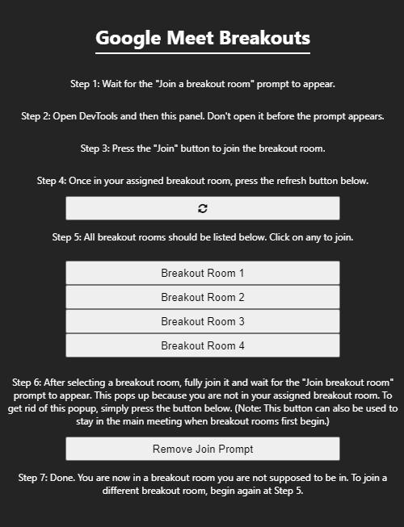

# Google Meet Breakout Security
 > A small Chrome extension to showcase a security vulnerability in Google Meet breakout rooms.

## Disclaimer
This project is purely for educational and research purposes. Do not use this code maliciously.

## Introduction
This vulnerability was discovered after a basic foray into how the Google Meet breakout room system works. The breakout rooms feature has almost no security implementations, and any that are in place are extremely easy to bypass. It can be assumed that Google hastily developed this feature to compete with Zoom for virtual learning. Still, the lack of permissions and necessary checks is borderline negligible from a security perspective. This vulnerability will be submitted to the Google Vulnerability Reward Program and hopefully fixed immediately.

## Images

## Meta

Mitch Zakocs – mitchell.zakocs@pridetronics.com

[https://github.com/mzakocs/](https://github.com/mzakocs/)

Distributed under the MIT License. See `LICENSE` for more information.

## How To Use

1. Clone the repository into an easily accessible folder
2. Enable [Developer Mode](https://developer.chrome.com/docs/extensions/mv2/faq/#:~:text=You%20can%20start%20by%20turning,a%20packaged%20extension%2C%20and%20more.) in Google Chrome
3. Head into the extension settings menu in Google Chrome (Shortcut: Alt+F > L > E)
4. Press "Load Unpacked" in the top left
5. Select the folder where you cloned the repository
6. Press F12 and navigate to the "Google Meet Breakouts" tab for usage instructions (or see [Images](##Images))

## Contributing

1. Fork it (<https://github.com/mzakocs/GoogleMeetBreakoutSecurity>)
2. Create your feature branch (`git checkout -b feature/fooBar`)
3. Commit your changes (`git commit -am 'Add some fooBar'`)
4. Push to the branch (`git push origin feature/fooBar`)
5. Create a new Pull Request